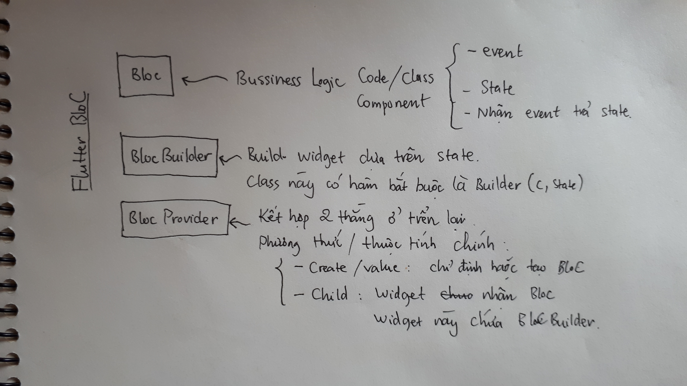

Nếu ai mới tìm hiểu về Flutter như mình sẽ gặp một chút khó khăn khi làm quen với các khái niệm. Một trong số đó là BLoC hay Bessiness Logic Component.

Đầu tiên nói về BLoC pattern nói chung:
 - BLoC đơn giản là khối xử lý logic được thiết kế để tách riêng phần code logic ra khỏi phần giao diện. Nếu bạn đã biết MVC thì BLoC không còn gì xa lạ.
 - BloC xử lý đầu vào là các Events và đầu ra là States. BLoC cũng có thể xử lý các tác vụ không đồng bộ.

 
[Nguồn ảnh](https://raw.githubusercontent.com/felangel/bloc/master/docs/assets/bloc_architecture.png)

Thứ hai, nói về Flutter BLoC. Nó được implement đầy đủ như thế nào?
 - Để áp dụng BLoC trong Flutter ta có thư viện [Bloc](https://pub.dev/packages/bloc) implement 3 Components chính đó là BLoc, BLoCBuilder, và BLoCProvider.
 - Tất nhiên khi code thì có hơi lằng nhẵng vì liên quan đến OOP chẳng hạn như truyền các tham số cho kiểu Generic, vv. Nhưng nếu hiểu vai trò của chúng thì ta đỡ bị rối.
 - Dưới đây mình note lại 3 core concept đó, nhìn vô sẽ rất dễ hiểu. Để chắc nữa chỉ cần đọc qua một lượt docs của thư viện tại [đây](https://bloclibrary.dev/#/flutterbloccoreconcepts) sẽ rõ ngay!
 
 

 - Trong Flutter, tất cả đều là widget, cũng giống như trong react, tất cả đều là view. BLoCProvider là thằng widget đặc biệt giúp ta tách riêng ra khối xử lý giao diện là BLoCBuilder và khối logic là BLoC.

Tóm lại, cũng không khó khăn lắm để nhận ra pattern này, Pattern trên cũng giống như Reducer bên React Native. Tuy nhiên nếu mò mẫm từ đầu thì rất mất thời gian.

