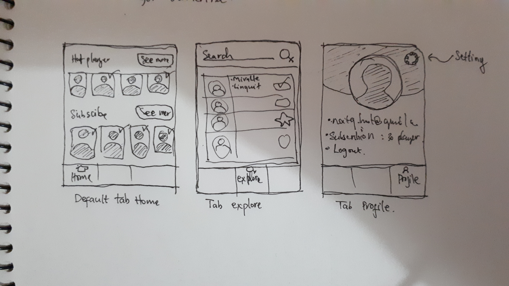

Productive là hướng tới sản phẩm, mang tính sản phẩm. Một người có tính productive tức là một người có phong cách làm việc hướng tới tạo ra sản phẩm.
Một người có tính productive thường là người có performance cao.

Trong sự nghiệp của một người thì thứ đánh giá mức độ thành công của họ là những thứ họ đạt được (achievement). Thành tích bao gôm tất tần tật những thứ như bằng cấp, giấy khen, chứng nhận, gia thế, nhà cửa, xe cộ, vv.
Trong đó những sản phẩm họ tạo ra cũng là một dạng thành tích đặc biệt. Ví dụ như xuất bản một ấn phẩm sách, truyện, bức họa, ứng dụng phần mềm. Những thứ đó là kết tinh trí tuệ. Ta có thể thấy có những ấn phẩm nhờ tính chất lượng xuất sắc, không chỉ nó được lưu truyền nhân thế, mà danh tiếng của tác giả cũng vang dội muôn đời.

### Productive rất quan trọng phải không?
Nếu như bạn là lập trình viên chắc bạn sẽ biết, ngay cả 1 cái project "hello world" được upload lên github cá nhân cũng có giá trị tô điểm cho 1 cái CV của bạn. Đó là bằng chứng cho nhà tuyển dụng lượng hóa bạn.

Nếu nhìn rộng ra ở khía cạnh ăn nói đi, bạn sẽ thấy có những người hay ho, có những người nhàm chán. Khi ở cạnh người hay ho thì ta vui vẻ nói chuyện không chán, còn khi ở cạnh người nhàm chán thì chỉ ngồi bấm bấm điện thoại!
Sự khác biệt giữa hai kiểu người này theo mình thấy là người hay ho luôn nói ra những lời nói chất, nhành động cá tính. Thậm chí trong những hoàn cảnh khó nói họ cũng nói cho hay được. Lời nói hay là sản phẩm của người thú vị. Còn người nhàm chán thì bạn biết rồi đó, họ không sản xuất ra được lời nói hay.

### Sao không cải thiện Productive dần dần?
Học được cái gì thì phải lượng hóa, cụ thể hóa, bằng chứng hóa nó ra. 
Ví dụ học Flutter thì cố mà làm được một cái app Flutter, đừng chỉ đọc code.
Muốn học tiếng anh thì sao không đặt cho mình mục tiêu đọc được hết quyển sách nào đó tiếng anh, kiếm 1 chứng chỉ tiếng anh, viết status dài bằng tiếng anh?
Muốn nói hay tại sao không tập viết những bài câu view thật thú vị và post lên MXH mỗi ngày? Sao cứ phải chỉ mỗi đọc lý thuyết về giao tiếp?

Để tăng tính productive, theo mình, mỗi ngày hãy thử set cho mình một mục tiêu nào đó sao cho cuối ngày nhất định phải cho ra sản phẩm.
Cuối ngày thì public cái sản phẩm đó ra cho nhiều người cùng thấy để tự sướng tinh thần. Đó là một cách để cỗ vũ cho những ngày tiếp theo.
Việc set mục tiêu này cũng có thể co hẹp lại thành mục tiêu 1 giờ để thăng tính tập trung. Hoặc set mục tiêu tuần, tháng, năm để tăng tính kiên trì, độ nhìn xa trông rộng.

### Kết
Bài viết vẫn giữ cái gốc vốn có từ đầu của tác giả là "tào lao" vì thế đọc đến dây chắc bạn đã biết độ tào lao của nó như nào!
Hơn nữa, khi bạn đọc đến đây, có nghĩa là mình đã hoàn thành được productive của ngày mà mình viết cái này!

Bonus, thêm cái ảnh mình vẽ sketch cái app đang làm thể hiện tí về productive :D

Ok! Chữ viết tay cần được cải thiện T_T

Cùng cải thiện tính productive nha các bạn!
