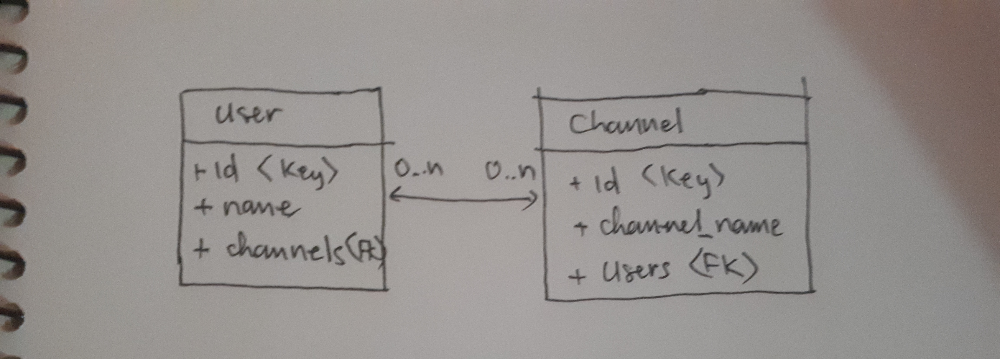

Hôm nay mình tiếp tục làm một ứng dụng nho nhỏ, trong đó ứng dụng có chức năng cho người dùng (user) đăng ký theo dõi (subscribe) các kênh livestream họ yêu thích (channel).
Hãy thử thiết kế database chứa thông tin người dùng và kênh họ theo dõi nha.

Thiết kế phải giải quyết vấn đề sau:
- Đảm bảo có thể truy vấn được thông tin người dùng và thông tin kênh yêu thích
- Đối với người dùng cụ thể, có thể tuy vấn danh sách các kênh họ theo dõi
- Đối với một kênh cụ thể, có thể truy vấn được danh sách những người theo dõi (subscribers)

Nếu bạn là frontend dev, bạn sẽ quen với REST api. Khi đó ta thường thấy quen việc gọi api lấy danh sách kênh mà một userid đã subscribe chỉ cần bằng truy vấn kiểu như sau
```
GET https://example.com/api/subscriptions/
```
Nó sẽ trả về cho ta một danh sách các kênh luôn.

Tuy nhiên, nếu bạn là backend dev. Bạn phải quan tâm database lưu dữ liệu như nào.

### Get started
- Đầu tiên là ta thiết kế ra 2 đối tượng: User và Channel tương ứng đối tượng người dùng và kênh.

- Sau đó ta xác định mối quan hệ giữa 2 đối tượng này.



- Theo kiến thức còn sót lại về database thì đó là quan hệ nhiều nhiều, n-n. Rõ ràng một người dùng có thể sẽ đăng ký nhiều kênh, và mỗi kênh có thể có nhiều người đăng ký.

- Rõ ràng với sql ta không thể lưu data theo kiểu user chứa nhiều channel kiểu lồng channel trong user được.

- Để giải quyết điều này thì từ cổ chí kim người ta đã thiết kế giải pháp đó là dùng thêm một table nữa. Table này thể hiện mối liên kết giữa User và Channel. Ta gọi table nầy là subscription. 


- Đối với Table User và Table Channel thì ta tạo khóa chính là id (rõ ràng).

- Đối với Table Subscription thì khóa chính là kết hợp 2 khóa chính của User và Channel <user_id, channel_id>.
- Lưu ý rằng, để liên kết, ta khai báo khóa ngoài (FK) cho User là channels trỏ đến Subscription và khóa ngoài cho Channel là users cũng trỏ đến Subscription. (Việc trỏ này hỗ trợ bở hệ quản trị cơ sở dữ liệu)
- Như vậy, nhờ có bảng subscription này, ta có thể lưu với mỗi bản ghi thể hiện một người có userid đang subscribe kênh có channel_id. 
Ngược lại là một kênh có channel_id được subscribed bởi người có user_id.
- Từ bảng này, việc truy vấn một người subscribe những kênh nào quá dễ rồi phải không. Chỉ cần truy vấn bảng subscription với điều kiện lọc ra các bản ghi nào có user_id mong muốn. 
- Từ bảng này, việc truy vấn một kênh được subscribed bởi những người nào cũng dẽ dàng làm được, tương tự như trên.

### Kết
Đó là bản chất thiết kế databse ứng dụng vào trường hợp cụ thể với bài toán user đăng ký nhiều kênh. Các bài toán tương tự như user mua nhiều sản phẩm ta cũng có thể áp dụng kiểu database quan hệ nhiều nhiều này.

Hiện nay nhiều cơ sở dữ liệu hỗ trợ sẵn cho bạn việc tạo relationship cho quan hệ nhiều nhiều. Thậm chí một số backend framework support Rest API còn làm sẵn hết, ta chỉ việc định nghĩa resource là framework tự tạo table.
Chẳng hạn, ngày xưa mình sử dụng loopback thì không cần quan tâm lắm đế database luôn. Giờ thử code lại bằng sử sụng framework thấp hơn như flask thì mới để ý đến vấn đề này.

Đây chỉ là note của riêng mình. Nó mặc định chỉ có giá trị với riêng mình và mình vẫn thấy đúng. Nếu có chỗ nào sai mong được góp ý. Để mình thấy được sự đúng hơn!
